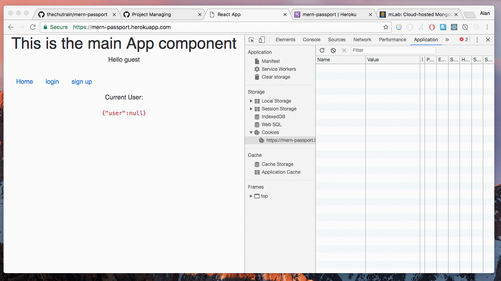

#LocalMotion App.
This application is an aim at creating a job market only maintained by craiglist odd jobs or very small entities.
Lawnmowing
Car Washing
Room cleaning
Plant watering
House vaccuming
Easy jobs anyone can do
etc.
Applicants would have to submit a resume and pass a test before being hired.
People will have a log in that will maintain the tasks they wish to be preformed and when/who will preform them.
A history of who helped the customer will be maintained as well as a star rating/review box for our employee.
The same for our employees, they can see their rating through their profile and can rate the people they have helped for other future employees.
A tip system will be implemented in case the customer wishes to do so via our application.

People will be able to post jobs and anyone within a (15?) mile radius (can bid on the job and or?)can be paid a flat rate per service through our company TBD.
Main page should consist of a small local map that will show reviews of neighbors.
Nav bar with  About us, Contact us
1.Main page with google earth image? or updating nasa image(cool api available) 
2.Log in page
3.Log in main page for customers to post jobs search rate past jobs/employees search for local employees via star rating etc.
4.Another (secondary) log in page for employees who can search for jobs that are posted and can also review.
5/6.Account pages for both employees and customers complete with tasks.
7.each employee would need an id number that would correspond with their payment from customers and give employees the ability to cash out at any time by linking to the same service uber uses they can cash out at any point in the day.
More to come.


------------------------------------------------------------------------------------------------------------------------------


### MERN + Passport.js
> example MERN stack application that uses authentication

* Mongo, Express, React, Node (MERN) + Passport.js for managing authentication
* This project was bootstrapped with [Create React App](https://github.com/facebookincubator/create-react-app).

## Demo


View the live version of this app here:
[https://mern-passport.herokuapp.com/](https://mern-passport.herokuapp.com/)

## Project Structure
```
|-- server/
|  |-- server.js                            // The entry point for running the backend server locally, and main server for production
|  |-- passport/                             // Configuration files used to connect to different machines or set settings
|     |-- index.js                     // Overloads the passport object and defines serialize and deserialize
|     |-- localStrategy.js            // Defines a local strategy
|     |-- googleStrategy.js           // Defines google OAuth stratgey
|     ....
|  |-- db/                             
|     |-- index.js                  // Configures the connection to the database
|     |-- models/                   // represents data from our database, and defines schemas for each collection
|        |-- user.js                // Schema for the User collection
| -- src/                           // Entry for the React client side application
```

## Note
* In order to set the google authentication up, you must register your app @ [https://console.developers.google.com](https://console.developers.google.com) & set `GOOGLE_CLIENT_ID` & `GOOGLE_CLIENT_SECRET` as environmental variables
* In development mode (i.e. `npm run dev`), OAuth google callback is not being proxied to the google servers. Therefore in order to test the google OAuth on your local machine do the following:
1) `npm run build`
2) `npm run prod`
